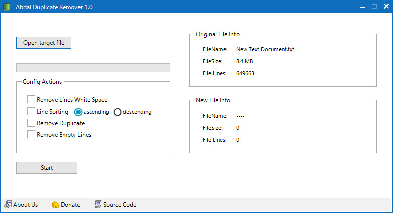

# نرم افزار حذف تکرار ابدال

  

[English](README.md) | [فارسی](README_FA.md)

## 🚀 معرفی
نرم افزار حذف تکرار ابدال یک ابزار قدرتمند برای پاکسازی و سازماندهی فایل‌های متنی است. این برنامه با استفاده از .NET 7 و رابط کاربری Telerik WinForm ساخته شده و رابط کاربری دوستانه‌ای برای حذف خطوط تکراری، مرتب‌سازی محتوا و سایر عملیات پاکسازی متن ارائه می‌دهد.

## ✨ ویژگی‌ها
- 🧹 حذف خطوط دارای فاصله سفید
- 📈 مرتب‌سازی خطوط به صورت صعودی
- 📉 مرتب‌سازی خطوط به صورت نزولی
- 🔄 حذف خطوط تکراری
- 📄 حذف خطوط خالی
- 📊 نمایش اطلاعات فایل اصلی (نام، حجم، تعداد خطوط)
- 📋 نمایش اطلاعات فایل جدید پس از اعمال تغییرات
- 💾 ذخیره فایل جدید با نام متفاوت

## 🖥️ نیازمندی‌های سیستم
- سیستم عامل ویندوز
- برای اجرا به نصب هیچ پیش نیازی ، احتیاج ندارید
- حداقل 1 گیگابایت رم
- 300 مگابایت فضای خالی دیسک

## 📥 نصب
1. دانلود آخرین نسخه از صفحه انتشارها
2. فایل نصبی را اجرا و نصب کنید.
3. اجرای فایل اجرایی Abdal Duplicate Remover - بدون نیاز به نصب هیچ برنامه اضافی!

## 🔧 نحوه استفاده
1. برنامه را اجرا کنید
2. برای انتخاب فایل متنی ورودی، روی دکمه "انتخاب فایل" کلیک کنید
3. عملیات‌های موردنظر خود را انتخاب کنید
4. برای شروع فرآیند پاکسازی، روی "شروع" کلیک کنید
5. فایل پردازش شده را با نام جدید ذخیره کنید

## ❤️ حمایت مالی
اگر این پروژه برای شما مفید بود و مایل به حمایت از توسعه بیشتر هستید، لطفاً در نظر داشته باشید که کمک مالی کنید:
- [اینجا اهدا کنید](https://alphajet.ir/abdal-donation)

## 🤵 برنامه‌نویس
ساخته شده با عشق توسط **ابراهیم شفیعی (EbraSha)**
- **ایمیل**: Prof.Shafiei@Gmail.com
- **تلگرام**: [@ProfShafiei](https://t.me/ProfShafiei)

## 📜 مجوز
این پروژه تحت مجوز GPLv2 or later منتشر شده است. 